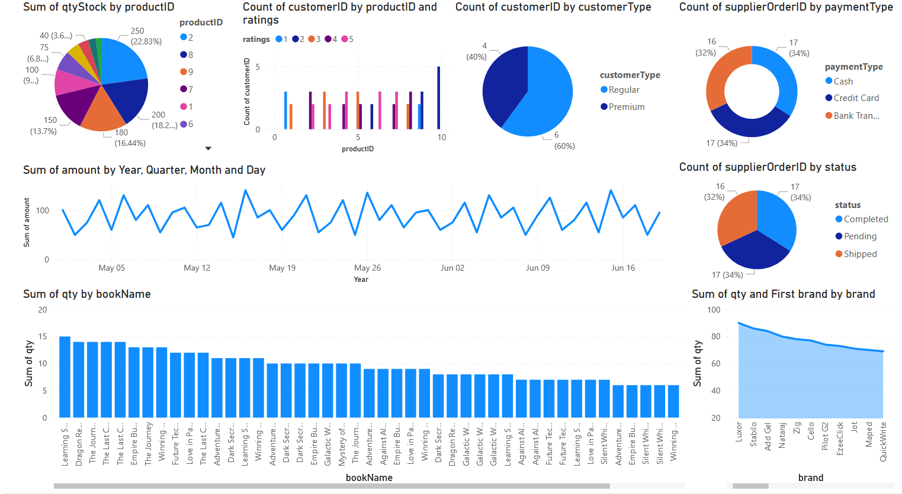

# Market Basket Analysis with Apriori

This project performs Market Basket Analysis using the Apriori algorithm on transaction data from a MySQL database. It discovers frequent itemsets and association rules, and visualizes the results with scatter plots and network graphs.


[View Interactive Power BI Dashboard](https://app.powerbi.com/reportEmbed?reportId=764021bf-d5fb-4ee2-8ce3-f089bdf6fd9f&autoAuth=true&ctid=9486ac65-39d3-4d25-977c-76d9c31c0046) 

## Features

- Connects to a MySQL database and loads transaction data
- Cleans and preprocesses data for analysis
- Finds frequent itemsets using the Apriori algorithm
- Generates association rules (support, confidence, lift)
- Visualizes rules with matplotlib and networkx

## Requirements

- Python 3.8+
- MySQL database with an `onlineretail` table
- The following Python packages (see [requirements.txt](requirements.txt)):
  - pandas
  - matplotlib
  - networkx
  - mysql-connector-python
  - python-dotenv
  - mlxtend

## Setup

1. **Clone the repository** and install dependencies:
    ```sh
    pip install -r requirements.txt
    pip install mlxtend mysql-connector-python python-dotenv
    ```

2. **Configure database connection**  
   Create a `.env` file in the project root with:
    ```
    DB_HOST=your_host
    DB_USER=your_user
    DB_PASSWORD=your_password
    DB_NAME=your_database
    ```

3. **Prepare your database**  
   Ensure your MySQL database has an `onlineretail` table with at least these columns:
   - `InvoiceNo`
   - `Description`
   - `Quantity`

## Usage

Run the main script:
```sh
python apriori.py
```

The script will:
- Connect to your database and load data
- Print frequent itemsets and top association rules
- Show a scatter plot of support vs confidence
- Display a network graph of the top association rules

## Files

- [apriori.py](apriori.py): Main analysis and visualization script
- [connector.py](connector.py): Database connection helper
- [requirements.txt](requirements.txt): Python dependencies
- [csvdata.csv](csvdata.csv): (Optional) Example data file

made by Dulhara :)